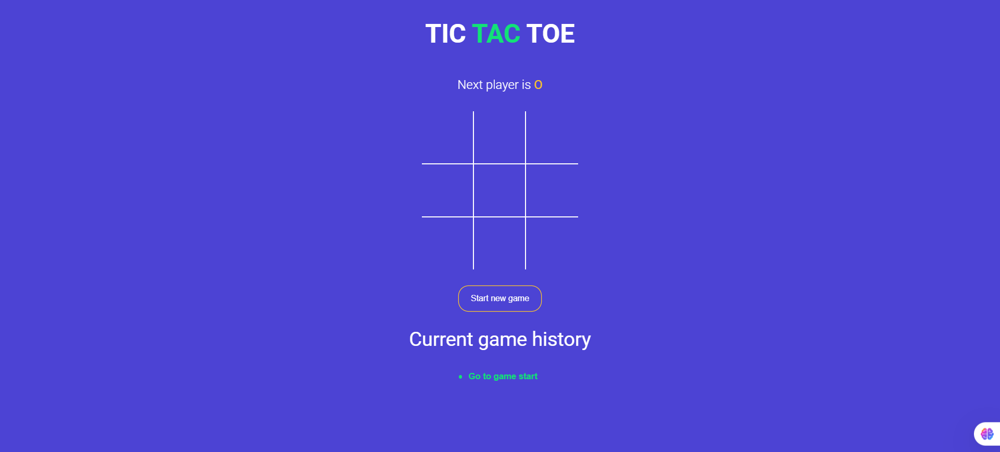

# Tic Tac Toe Game

A simple **Tic Tac Toe** game built with **React.js**. Players take turns to mark spaces on a 3x3 grid. The first player to get three of their marks in a row (horizontally, vertically, or diagonally) wins the game.

## Demo



## Features

- **2 Player Mode**: Play with another player on the same device.
- **Winning Detection**: The game detects when a player wins or the game ends in a draw.
- **Turn-based Play**: Players alternate turns between 'X' and 'O'.
- **Game Reset**: Restart the game at any time.
- **Simple User Interface**: Clean and easy-to-use interface.

## Technologies Used

- **React.js**: JavaScript library for building the user interface.
- **CSS**: For styling the Tic Tac Toe grid and game elements.
- **JavaScript**: For managing game logic, player turns, and win conditions.
- **HTML**: For basic structure and layout.

## Installation

To run this project locally, follow these steps:

### 1. Clone the repository:
```bash
git clone https://github.com/yourusername/tic-tac-toe.git
